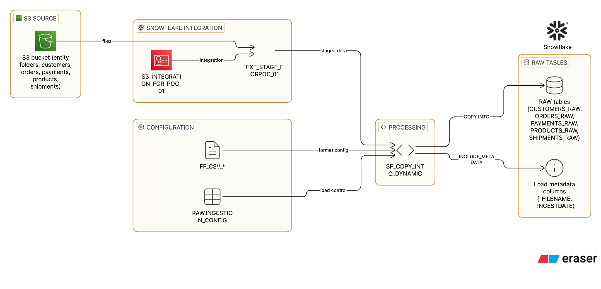

# POC 01 - Metadata-Driven Ingestion with Dynamic COPY INTO

## Purpose
This POC demonstrates a metadata-driven ingestion framework in Snowflake using a dynamic `COPY INTO` stored procedure. The goal is to load multiple source entities from an external stage in S3 into RAW tables based on configuration stored in a control table.

## What This POC Showcases
- External stages and storage integrations with S3
- File format definitions for CSV ingestion
- Schema evolution on RAW tables
- Dynamic SQL in a stored procedure
- `COPY INTO` with `MATCH_BY_COLUMN_NAME` and `INCLUDE_METADATA`
- Metadata-driven ingestion controlled via a config table

## High-Level Flow
1. Define storage integration and external stage pointing to an S3 bucket.
2. Create file formats for each entity.
3. Create RAW tables with schema evolution enabled.
4. Create `INGESTION_CONFIG` table with one row per source entity.
5. Execute a stored procedure that reads the config and runs dynamic `COPY INTO` per entity.

## Object Inventory

### Configuration
- `ingestion/config/config_table.sql`
  - Creates `RAW.INGESTION_CONFIG` with columns: `source_name`, `file_format`, `target_table_name`, `s3_folder_path`, `enabled`.
  - Inserts default rows for `customers`, `orders`, `payments`, `products`, `shipments`.

### External Stage
- `raw/stages/S3_EXTERNAL_STAGE.sql`
  - Creates `S3_INTEGRATION_FOR_POC_01`.
  - Creates stage `EXT_STAGE_FORPOC_01` pointing to `s3://snowflakeloadingpurposes/poc_01_metadata_driven_ingestion/raw/`.
  - Lists staged files.
  - Note: the stored procedure uses `@EXT_STAGE_FOR_POC_01`, so the stage name should be kept consistent.

### File Formats
- `raw/file_formats/FF_CSV_*.sql`
  - CSV formats with `PARSE_HEADER = TRUE`, `ERROR_ON_COLUMN_COUNT_MISMATCH = FALSE`.
  - These settings support schema evolution and `MATCH_BY_COLUMN_NAME`.

### RAW Tables
- `raw/tables/*.sql`
  - Entity tables such as `CUSTOMERS_RAW`, `ORDERS_RAW`, `PAYMENTS_RAW`, `PRODUCTS_RAW`, `SHIPMENTS_RAW`.
  - `_FILENAME` and `_INGESTDATE` columns included for load metadata.
  - `ENABLE_SCHEMA_EVOLUTION = TRUE` on at least `CUSTOMERS_RAW`.

### Stored Procedure
- `ingestion/procedures/sp_copy_into_dynamic.sql`
  - `SP_COPY_INTO_DYNAMIC(table_list_array ARRAY DEFAULT NULL)`
  - If `table_list_array` is `NULL`, it loads all `enabled = TRUE` sources in `INGESTION_CONFIG`.
  - If an array is provided, it loads only the listed sources.
  - Builds dynamic `COPY INTO` with:
    - `INCLUDE_METADATA = (_FILENAME = METADATA$FILENAME, _INGESTDATE = METADATA$START_SCAN_TIME)`
    - `MATCH_BY_COLUMN_NAME = CASE_INSENSITIVE`

### Orchestration / Validation
- `main.sql`
  - Example calls and validation queries (`INFORMATION_SCHEMA.LOAD_HISTORY`, row counts, config inspection).

## Execution Order (Suggested)
1. Run `raw/stages/S3_EXTERNAL_STAGE.sql` to create integration and stage.
2. Run all `raw/file_formats/*.sql`.
3. Run all `raw/tables/*.sql`.
4. Run `ingestion/config/config_table.sql`.
5. Run `ingestion/procedures/sp_copy_into_dynamic.sql`.
6. Execute `CALL sp_copy_into_dynamic();` or `CALL sp_copy_into_dynamic(['customers','orders']);`.
7. Validate using `main.sql` queries.

## Diagram Hints (For Flowcharts / ETL)
- Source: S3 bucket folders per entity.
- Stage: `EXT_STAGE_FORPOC_01` (external stage).
- Control: `RAW.INGESTION_CONFIG` drives which entities load.
- Compute: `SP_COPY_INTO_DYNAMIC` loops config and issues `COPY INTO`.
- Target: `RAW.*_RAW` tables with schema evolution and metadata columns.

## Notes / Learnings Captured in Code
- `MATCH_BY_COLUMN_NAME` requires headers and consistent naming.
- `ERROR_ON_COLUMN_COUNT_MISMATCH = FALSE` allows flexible schema changes.
- Schema evolution avoids manual positional mapping in dynamic SQL.
- The procedure can be improved by defaulting metadata columns in the table definition.

