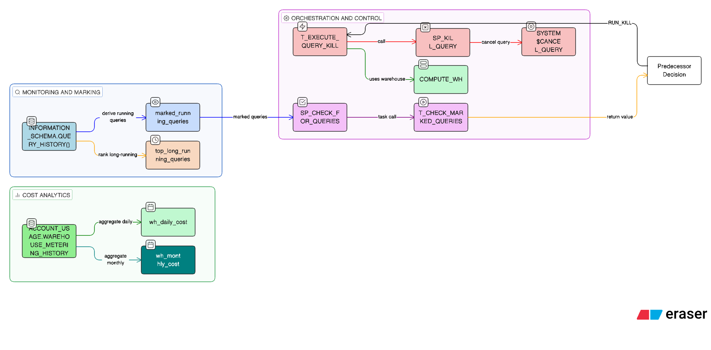

# POC 02 - Cost Governance and Query Control

## Purpose
This POC demonstrates cost governance techniques in Snowflake by monitoring long-running queries, marking them for termination, and executing a conditional task hierarchy that can cancel problematic queries. It also includes analytics views for warehouse credit usage and long-running query analysis.

## What This POC Showcases
- Monitoring live queries via `INFORMATION_SCHEMA.QUERY_HISTORY()`
- Threshold-based marking of long-running queries
- Stored procedures to check and cancel queries
- Task hierarchy with conditional execution and serverless root task
- Cost analytics using `SNOWFLAKE.ACCOUNT_USAGE.WAREHOUSE_METERING_HISTORY`

## High-Level Flow
1. Build a view of currently running queries and mark those exceeding a threshold.
2. Root task runs on a schedule and checks for marked queries.
3. If marked queries exist, a child task runs and cancels them using `SYSTEM$CANCEL_QUERY`.
4. Separate analytics views summarize warehouse costs and long-running query patterns.

## Object Inventory

### Orchestration / Validation
- `main.sql`
  - Currently mirrors the ingestion POC example queries; treat as a scratchpad and update as needed for cost governance runs.

### Monitoring / Detection
- `monitoring/running_queries_over_threshold.sql`
  - Creates view `marked_running_queries` from `INFORMATION_SCHEMA.QUERY_HISTORY()`.
  - Calculates `actual_execution_time` and flags `MARKED_FLAG = 'Y'` when runtime >= 15 minutes.

- `staging/stg_marked_queries.sql`
  - A standalone query version for inspecting the same logic without the view.

- `raw/info_schema_reference_query.sql`
  - Reference query showing why `INFORMATION_SCHEMA.QUERY_HISTORY()` is needed for live queries.

### Stored Procedures
- `monitoring/sp_check_for_queries.sql`
  - Counts marked queries and returns a task predecessor value of `SKIP` or `RUN_KILL`.

- `monitoring/sp_kill_query.sql`
  - Iterates through marked queries and calls `SYSTEM$CANCEL_QUERY`.

### Task Hierarchy
- `monitoring/task_hierachy.sql`
  - Root task `T_CHECK_MARKED_QUERIES` (serverless, scheduled every 30 minutes).
  - Child task `T_EXECUTE_QUERY_KILL` (runs only when root returns `RUN_KILL`).
  - Uses a dedicated warehouse only when needed to avoid unnecessary costs.

### Analytics Views
- `analytics/views/wh_cost_daily.sql`
  - Daily warehouse credit usage from `SNOWFLAKE.ACCOUNT_USAGE.WAREHOUSE_METERING_HISTORY`.

- `analytics/views/wh_cost_monthly.sql`
  - Monthly aggregation of warehouse credit usage.

- `analytics/views/top_long_running_queries.sql`
  - Ranks top 5 longest queries per warehouse (non-running) by elapsed time.

## Execution Order (Suggested)
1. Run `monitoring/running_queries_over_threshold.sql` to create `marked_running_queries`.
2. Run `monitoring/sp_check_for_queries.sql` and `monitoring/sp_kill_query.sql`.
3. Run `monitoring/task_hierachy.sql` to create and resume tasks.
4. Optionally run analytics views under `analytics/views/`.
5. Validate with `staging/stg_marked_queries.sql` as needed.

## Diagram Hints (For Flowcharts / ETL)
- Source: `INFORMATION_SCHEMA.QUERY_HISTORY()` (live queries).
- Transform: `marked_running_queries` view flags over-threshold queries.
- Orchestration: `T_CHECK_MARKED_QUERIES` root task.
- Decision: `SYSTEM$GET_PREDECESSOR_RETURN_VALUE` == `RUN_KILL`.
- Action: `T_EXECUTE_QUERY_KILL` runs `SP_KILL_QUERY` and cancels queries.
- Analytics branch: `ACCOUNT_USAGE.WAREHOUSE_METERING_HISTORY` to daily/monthly views.

## Notes / Operating Assumptions
- Threshold for long-running queries is currently 15 minutes.
- Root task uses Snowflake serverless compute; child task uses `COMPUTE_WH` only when necessary.
- `ACCOUNT_USAGE` views can have data latency; use for cost analytics, not real-time control.

